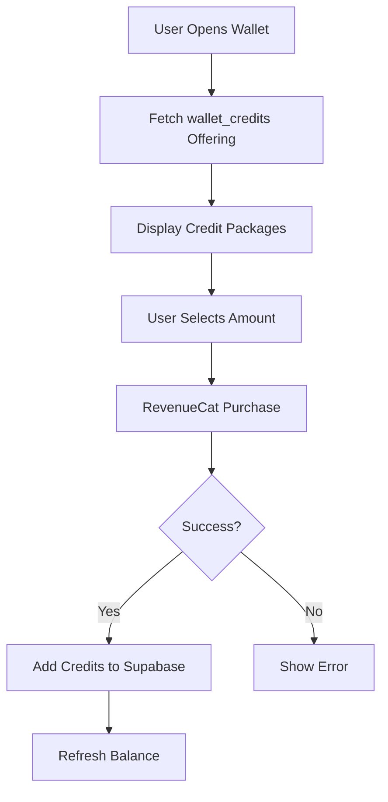
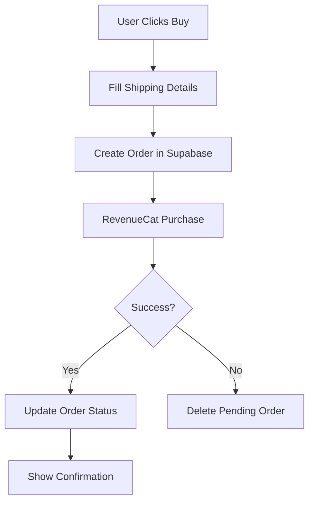

# RevenueCat Wallet & Purchase Setup Guide

## Overview

This guide explains how to configure RevenueCat for wallet recharge and product purchases in the Vedic Mate app.

---

## Step 1: Create Wallet Credit Products

### In App Store Connect (iOS)

1. Go to **App Store Connect** → Your App → **In-App Purchases**
2. Click **"+"** to create new products
3. Select **"Consumable"** type
4. Create the following products:

| Product ID | Reference Name | Price |
|-----------|---------------|-------|
| `wallet_50` | Wallet Credit ₹50 | ₹50 |
| `wallet_100` | Wallet Credit ₹100 | ₹100 |
| `wallet_200` | Wallet Credit ₹200 | ₹200 |
| `wallet_500` | Wallet Credit ₹500 | ₹500 |
| `wallet_1000` | Wallet Credit ₹1000 | ₹1000 |
| `wallet_2000` | Wallet Credit ₹2000 | ₹2000 |
| `wallet_5000` | Wallet Credit ₹5000 | ₹5000 |

5. Submit for review

### In Google Play Console (Android)

1. Go to **Google Play Console** → Your App → **Monetize** → **Products** → **In-app products**
2. Click **"Create product"**
3. Select **"Consumable"** type
4. Create the same products as above with matching Product IDs
5. Activate products

---

## Step 2: Link Products to RevenueCat

1. Go to **RevenueCat Dashboard** → **Products**
2. Click **"+ New"** for each product
3. Fill in:
   - **Identifier**: `wallet_100` (match App Store/Play Store)
   - **Type**: Consumable
   - **App Store Product ID**: `wallet_100`
   - **Play Store Product ID**: `wallet_100`
4. Click **"Save"**
5. Repeat for all 7 wallet credit products

---

## Step 3: Create Wallet Credits Offering

1. Go to **RevenueCat Dashboard** → **Offerings**
2. Click **"+ New"**
3. Fill in:
   - **Identifier**: `wallet_credits`
   - **Description**: Wallet credit packages
4. Click **"Save"**
5. Add packages:
   - Click **"+ Add Package"**
   - **Identifier**: `wallet_100`
   - **Product**: Select `wallet_100`
   - Click **"Save"**
6. Repeat for all 7 products
7. **Set as Current Offering** (optional, or keep as separate offering)

---

## Step 4: Create Supabase Orders Table

1. Go to **Supabase Dashboard** → Your Project → **SQL Editor**
2. Click **"New query"**
3. Copy and paste the SQL from `supabase/orders_table.sql`
4. Click **"Run"**
5. Verify table creation in **Table Editor**

The SQL file is located at:
```
/Users/harshdev/Documents/Projects/astroapp/supabase/orders_table.sql
```

---

## Step 5: Test Wallet Recharge

### iOS Testing

1. Add sandbox tester in App Store Connect
2. Sign out of App Store on device
3. Run app and go to Wallet
4. Select a wallet credit amount
5. Complete sandbox purchase
6. Verify credits added to wallet

### Android Testing

1. Add test account in Google Play Console
2. Install app via internal testing track
3. Go to Wallet
4. Select a wallet credit amount
5. Complete test purchase
6. Verify credits added to wallet

---

## How It Works

### Wallet Recharge Flow



### Product Purchase Flow



---

## Code Integration

### Wallet Screen

The wallet screen (`lib/screens/client/wallet_recharge_screen.dart`) now:
- Fetches wallet credit packages from RevenueCat
- Displays them in a grid
- Handles purchase via `purchaseWalletCredit()`
- Adds credits to Supabase on success

### RevenueCat Service

New methods added to `lib/services/revenuecat_service.dart`:
- `getWalletOffering()` - Fetch wallet credits offering
- `purchaseWalletCredit()` - Purchase consumable credits
- `purchaseProduct()` - Purchase non-consumable products
- `getOfferingById()` - Get specific offering

### Order Service

Created `lib/services/order_service.dart` for Supabase integration:
- `createOrder()` - Create order before payment
- `updatePaymentStatus()` - Update after RevenueCat purchase
- `getOrders()` - Fetch user orders
- `getOrderById()` - Get single order

---

## Troubleshooting

### Products Not Showing

**Issue**: Wallet packages not displaying in app

**Solutions**:
1. Verify products are approved in App Store Connect/Play Console
2. Check product IDs match exactly in RevenueCat
3. Ensure `wallet_credits` offering exists
4. Check RevenueCat logs in debug mode

### Purchase Fails

**Issue**: Purchase initiated but fails

**Solutions**:
1. Verify API key is correct
2. Check user is identified with RevenueCat
3. Ensure products are active
4. Check device/account is set up for testing

### Credits Not Added

**Issue**: Purchase succeeds but wallet balance doesn't update

**Solutions**:
1. Check Supabase connection
2. Verify `wallets` table exists
3. Check user ID matches
4. Review error logs in app

---

## Production Checklist

Before going live:

- [ ] All wallet credit products approved in App Store
- [ ] All wallet credit products approved in Play Store
- [ ] Products linked to RevenueCat
- [ ] `wallet_credits` offering created
- [ ] Orders table created in Supabase
- [ ] Tested wallet recharge on iOS
- [ ] Tested wallet recharge on Android
- [ ] Verified credits added to Supabase
- [ ] Tested error scenarios
- [ ] Production API key configured

---

## Support

- **RevenueCat Docs**: https://docs.revenuecat.com/
- **Consumables Guide**: https://www.revenuecat.com/docs/making-purchases#consumables
- **Supabase Docs**: https://supabase.com/docs

---

## Summary

Your app now supports:
✅ Wallet recharge via RevenueCat consumable products
✅ Order tracking in Supabase
✅ Transaction history
✅ Sandbox testing support
✅ Production-ready infrastructure

Next: Configure products in RevenueCat dashboard and test!
